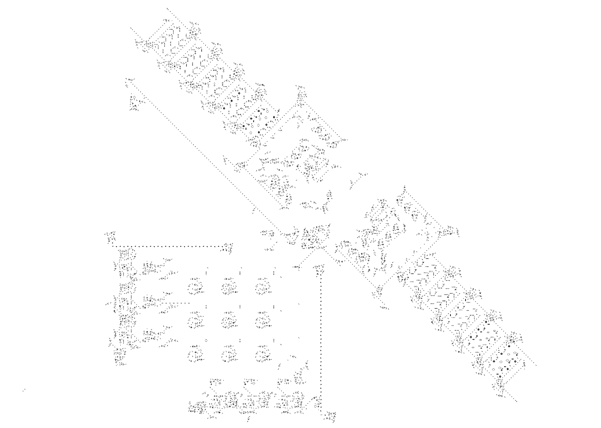
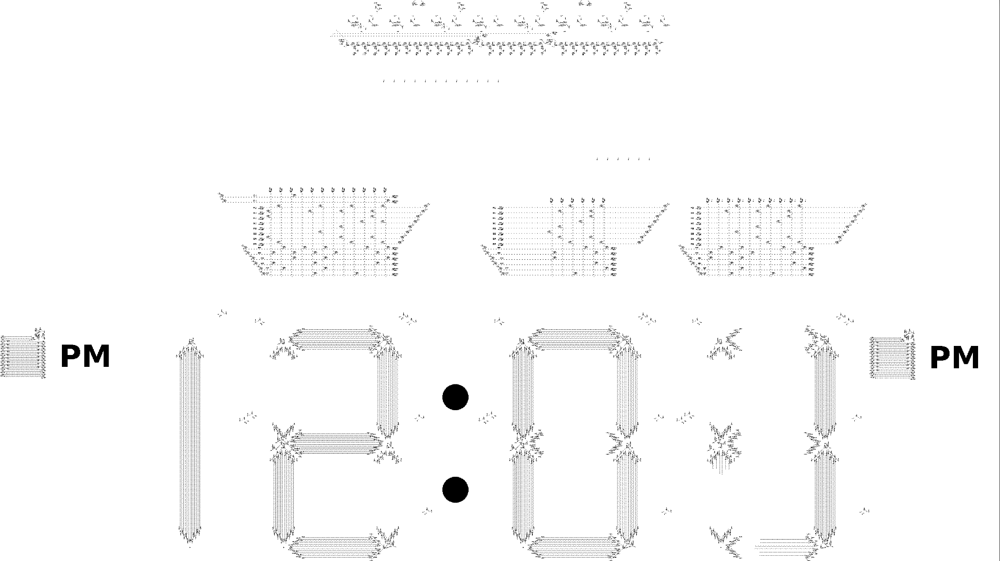

## Cellular Automata based on GPU

**`.rle` file supported**

**Controll:**

`Space`: Pause/Start

`wasd`: Move

`MouseWheel`: Scale

`Click`: Add/Remove

**2K 700FPS GTX1080:**

**Turing machine:**

**Clock 10016*6796 350FPS:**
